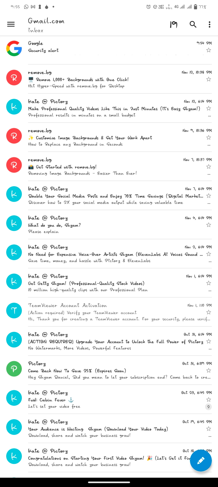

# SugarMail

SugarMail is a versatile and feature-rich email client designed to simplify and enhance your email experience. With a sleek interface and advanced features, it provides seamless access to your inbox, outbox, and more.

---

## Features

- **Multiple Account Support**: Easily manage multiple email accounts in one place.
- **Compose Emails**: Quickly draft and send emails with a user-friendly interface.
- **Inbox & Outbox Management**: Organize and access your emails efficiently.
- **Permissions**: Detailed permission controls for privacy and security.
- **Custom Features**: Designed to improve productivity and simplify email workflows.

---

## Screenshots

Below are some screenshots showcasing the application's features:

| Screenshot           | Description                         |
|----------------------|-------------------------------------|
|  | Add a new account easily.            |
|  | Step-by-step account addition.       |
|  | Intuitive email composition.         |
|  | Explore productivity-enhancing tools.|
|  | More advanced features.              |
|  | Insights into usage.                 |
|  | Enhance email organization.          |
|  | Access and organize your inbox.       |
|  | Full inbox and outbox control.      |
|  | Manage app permissions effectively. |
|  | Intuitive user prompts.               |
|  | Visual representation of usage.      |

---

## Installation

1. Clone the repository:  
   ```bash
   git clone https://github.com/BugBae/SugarMail-main.git

2. Navigate to the project directory:

cd SugarMail-main


3. Build and run the app on your preferred device.


---

License

This project is licensed under the BugBae License. See the LICENSE file for more details.


---

Developed by BugBae
